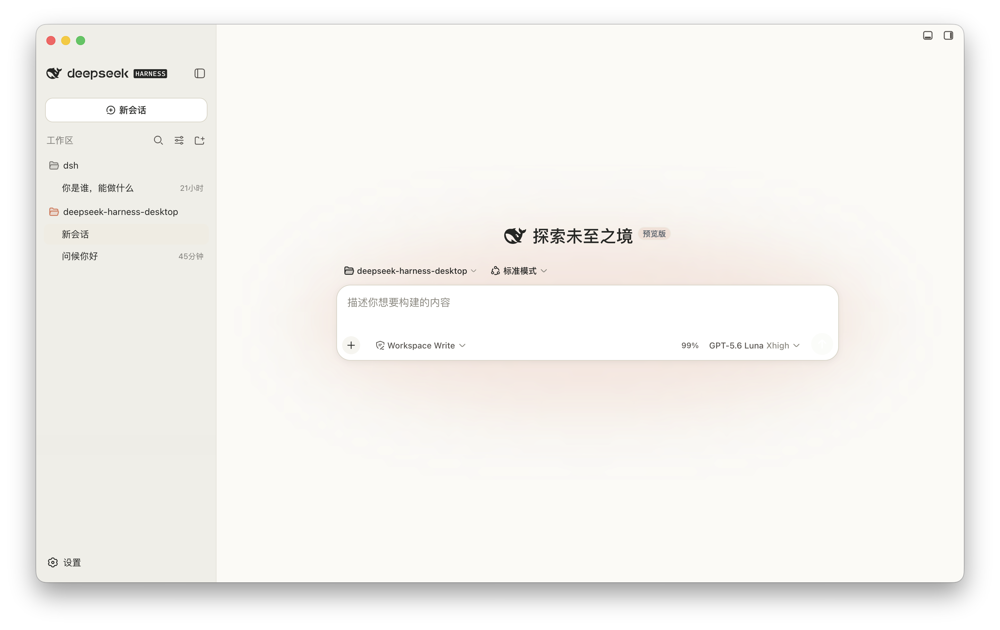
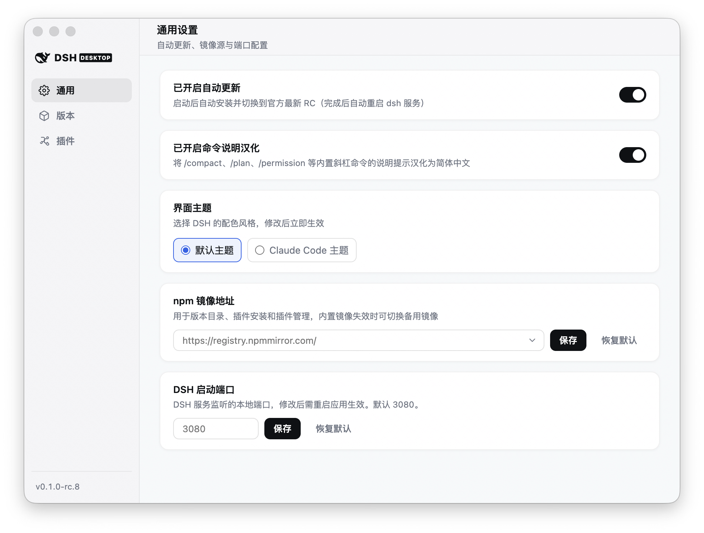
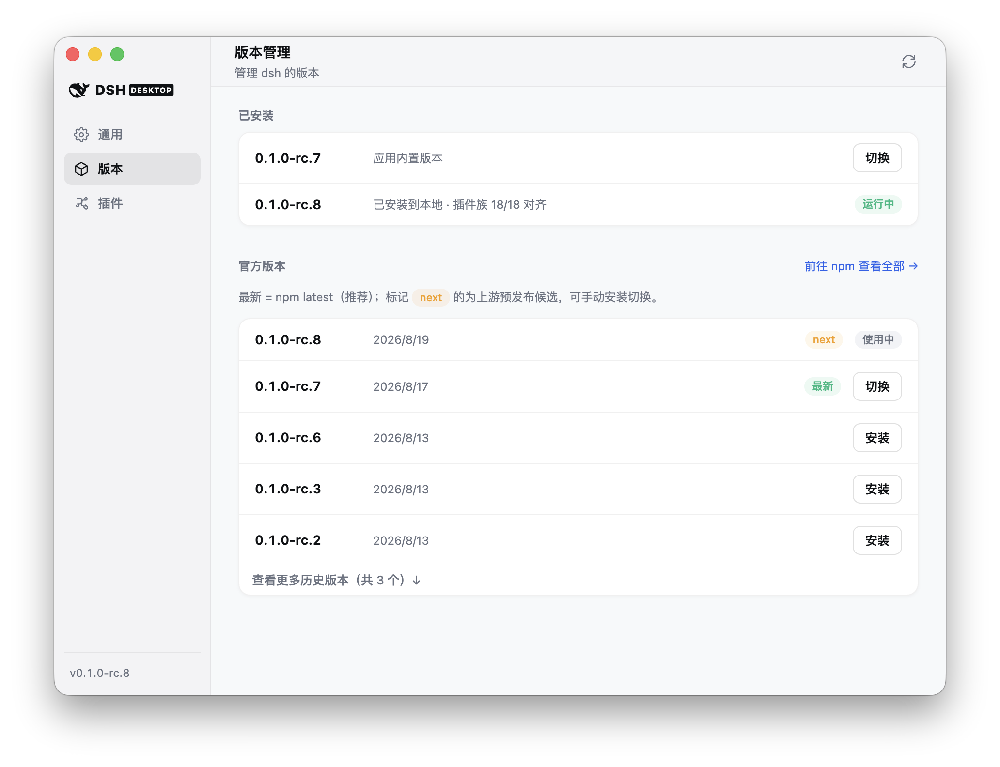
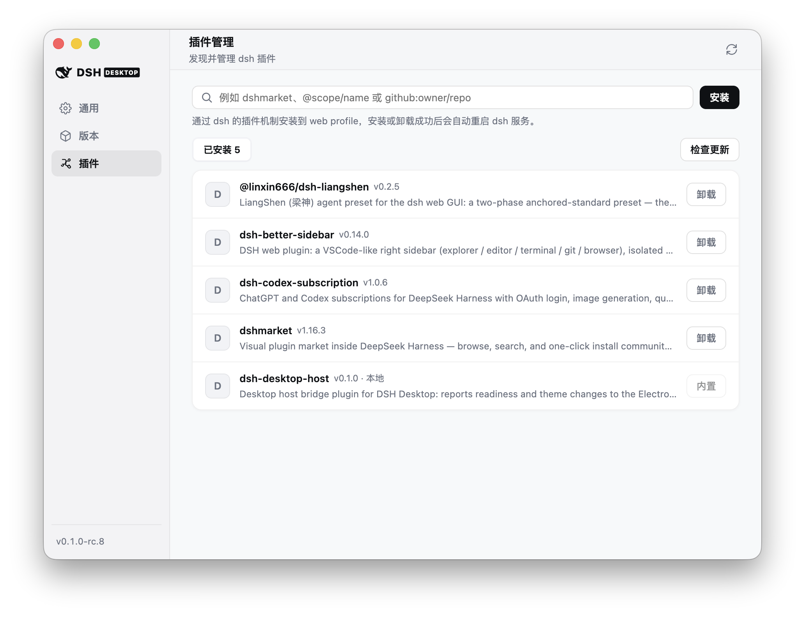

<h1 align="center">
  
  <br />
  DSH Desktop
</h1>

<p align="center">
  面向 <a href="https://github.com/deepseek-ai/deepseek-harness">DeepSeek Harness</a>
  的轻量、本地优先、跨平台桌面封装。
</p>

<p align="center">
  <a href="https://github.com/krystal-cao/deepseek-harness-desktop/releases/latest"></a>
  <a href="LICENSE"></a>
  <a href="https://github.com/krystal-cao/deepseek-harness-desktop/actions/workflows/release.yml"></a>
  
</p>

DSH Desktop 将官方 DeepSeek Harness Web 体验封装为独立桌面应用。无需手动启动 CLI 或管理端口，打开应用即可使用完整 Harness 界面。

本项目专注于桌面宿主能力，模型、会话、设置、插件和 Agent 能力均由官方 `@deepseek-ai/dsh` 提供。同时提供优雅的桌面宿主扩展（如 Claude Code 暖色风主题、命令说明汉化、版本与插件管理面板、任务完成桌面通知等）。

> [!IMPORTANT]
> 本项目是非官方社区封装，目前仍属于早期版本，并依赖快速演进中的 `@deepseek-ai/dsh`（当前固定版本见 `package.json` 的 `dependencies` 字段）。macOS 构建尚未经过 Apple 公证。

## 下载

| 平台 | 架构 | 安装包 | 下载 |
| --- | --- | --- | --- |
| macOS | Apple Silicon | DMG / ZIP | [下载](https://github.com/krystal-cao/deepseek-harness-desktop/releases/latest) |
| macOS | Intel | DMG / ZIP | [下载](https://github.com/krystal-cao/deepseek-harness-desktop/releases/latest) |

全部当前和历史安装包可在 [GitHub Releases](https://github.com/krystal-cao/deepseek-harness-desktop/releases) 查看。

---

## 界面预览

### 💬 主界面与主题配色

<h4 align="center">原生默认主题</h4>
<p align="center">
  
</p>

<h4 align="center">Claude Code 暖色纸感主题</h4>
<p align="center">
  
</p>

### ⚙️ 独立设置中心 (`⌘,`)

快捷键 `⌘,` 随时唤起独立设置管理窗口，提供三大核心管理模块：

<h4 align="center">1. 通用设置</h4>
<p align="center">
  <i>支持配置自动更新开关、内置斜杠命令说明汉化、界面主题切换、npm 镜像源预设以及自定义服务监听端口。</i>
</p>
<p align="center">
  
</p>

<h4 align="center">2. 版本管理</h4>
<p align="center">
  <i>实时抓取 npm 官方最新版本与 Release Candidate 候选版本，支持一键安装、平滑切换与卸载，自动对齐宿主插件族。</i>
</p>
<p align="center">
  
</p>

<h4 align="center">3. 插件管理</h4>
<p align="center">
  <i>可视化管理 Web Profile 下的全部第三方插件，支持一键安装、检查更新、一键全量升级与安全卸载。</i>
</p>
<p align="center">
  
</p>

---

## 为什么需要桌面版

DeepSeek Harness 已经提供完整的 Agent Runtime 和 Web UI。DSH Desktop 不重复实现这些能力，而是补充桌面应用所需的宿主层：

- 自动启动和关闭本地 Harness 服务
- 默认监听 `127.0.0.1:3080` 本地回环端口（支持在设置中自定义）
- 等待 Harness 就绪后再显示应用窗口
- 提供单实例桌面窗口和外部链接安全处理
- 为渲染进程启用沙箱、`contextIsolation` 和导航限制
- 为 macOS（Apple Silicon 与 Intel）提供可直接安装的发行包

## 主要特性

- **官方原生体验**：Harness 就绪后直接进入官方界面，保留完整的会话、模型、插件和 Agent 能力。
- **内置界面主题切换**：支持默认主题与「Claude Code 暖色主题」（warm paper 纸感调色板与陶土橙品牌色），即点即换，完全静默无感。
- **内置斜杠命令说明汉化**：在通用设置中一键开启内置斜杠命令（`/compact`、`/plan`、`/permission` 等）的中文说明提示，即时生效。
- **全量中英文双向同步**：系统主菜单栏（Menu Bar）与设置管理窗口实时跟随 DSH 宿主语言（`zh` / `en`）自动切换，无缝本地化。
- **第三方主题防冲突保护**：全链路智能识别外部主题与各类独立皮肤插件，激活外部主题时自动熔断内置主题；卸载外部主题后自动恢复原设主题。
- **通用设置面板**：支持设置自动更新开关、命令汉化开关、界面主题、npm 镜像源预设以及自定义 DSH 服务启动端口。
- **内置 DSH 版本管理**：可从 npm 直接安装、切换、卸载官方 `@deepseek-ai/dsh` 版本，安装时自动对齐桌面内置插件族，无需重新打包应用。
- **支持自动跟随官方最新 RC**：启动后后台静默检测、安装并切换到 npm 上最新的 `0.1.0-rc.*` 版本。
- **可视化插件管理**：在设置窗口中一键查看、安装、卸载 web profile 的第三方插件（等价于 `dsh plugin --profile web ...`），操作后自动重启服务生效。
- **桌面任务完成通知**：当 Agent 执行耗时任务时，若窗口失去焦点或已最小化/隐藏，任务完成后自动发送 macOS 系统级通知，点击可快速唤回主窗口。
- **原生 macOS 体验**：自定义沉浸式标题栏与深浅色主题自然融合，红绿灯始终对齐侧边栏；支持快捷键 `⌘,` 随时唤起设置窗口。

## 安装说明

### macOS

macOS 构建已进行完整性签名，但尚未经过 Apple 公证。首次启动：

1. 打开 DMG，将 **DSH** 拖入“应用程序”。
2. 尝试打开应用；如果 macOS 阻止启动，请点击“完成”。
3. 打开“系统设置 → 隐私与安全性”。
4. 在“安全性”区域找到 DSH，点击“仍要打开”。
5. 再次点击“打开”确认。

该确认通常只需完成一次。

## 安全模型

- Harness 服务仅绑定 `127.0.0.1:3080`，固定端口避免 prompt cache 失效
- Renderer 禁用 Node.js 集成
- 启用 `contextIsolation` 和 Chromium sandbox
- 新窗口和跨域导航交由系统浏览器处理
- Harness 在独立的 Electron Node 子进程中运行
- Cordis HMR 所需的 `--expose-internals` 只授予 Harness 子进程，不暴露给 Renderer
- 桌面宿主桥接插件从应用内置路径自动安装（无网络依赖），只上报就绪和主题
  事件，并在插件列表中标记为“内置”

## 运行架构

```text
DSH Desktop
├── Electron Main
│   ├── 单实例窗口
│   ├── Harness 子进程生命周期
│   ├── 固定回环端口 (3080) 与就绪检测
│   └── 平台菜单和外部链接处理
│
├── Harness Child Process
│   └── @deepseek-ai/dsh web
│       └── http://127.0.0.1:3080
│
└── Sandboxed BrowserWindow
    └── DeepSeek Harness Web UI
```

## 当前验证状态

| 平台 | 构建 | 打包后启动 | Web UI |
| --- | --- | --- | --- |
| macOS Apple Silicon | DMG / ZIP 通过 | 通过 | HTTP 200 |
| macOS Intel | DMG / ZIP 通过 | 通过 | HTTP 200 |

所有发行包都由匹配平台的 GitHub-hosted runner 构建，并在发布前执行打包后 smoke test。

## 已知限制

- 上游 DSH 仍是 RC 版本，接口和行为可能快速变化
- macOS 尚未接入 Developer ID 和 notarization
- 目前只提供 macOS 构建（Apple Silicon 与 Intel）

## 自动更新与配置管理

本应用通过 `electron-updater` 提供整包自动更新。一次更新会替换整个应用，包括内置的 `@deepseek-ai/dsh` 运行时。

如果想更快跟上上游，也可以使用内置的**设置窗口**（顶部菜单 `DSH → 设置…` 或快捷键 `⌘,`）：
- **通用**：设置界面主题（默认 / Claude Code）、命令说明汉化、自动更新开关、npm 镜像源预设（支持 npmmirror、官方、腾讯云等）以及自定义 DSH 服务启动端口。
- **版本**：直接从 npm 安装并切换到新版官方 `@deepseek-ai/dsh`，支持开启“自动跟随最新 RC”。
- **插件**：可视化查看、安装、卸载 web profile 的第三方插件。

- 打包后的应用会在启动 5 秒后检查更新，之后每 4 小时检查一次；**DSH** 应用菜单也提供**检查更新…**入口。
- 更新源在构建时写入 `app-update.yml`。CI 会自动指向本仓库的 GitHub Releases；本地构建则修改 `package.json` 中 `build.publish.owner` / `build.publish.repo`。
- 运行时覆盖：设置 `DSH_UPDATE_URL` 可切换到 generic 更新源（适合测试或非 GitHub 镜像）；设置 `DSH_DISABLE_AUTO_UPDATE=1` 可关闭更新。npm registry 默认使用国内镜像 `registry.npmmirror.com`（用于版本目录和运行时安装），可通过 `DSH_NPM_REGISTRY` 覆盖或直接在设置面板中修改保存。

### 发版流程

1. `node scripts/check-upstream.mjs` — 对比当前固定的 dsh 版本与 npm 最新版。
2. `node scripts/bump-dsh.mjs 0.1.0-rc.x` — 把所有 `@deepseek-ai/dsh*` 固定依赖
   升到同一版本，重新安装并运行测试。
3. `npm run dist:mac:all && npm run smoke:packaged` — 验证打包后的应用能启动
   并返回 HTTP 200（同时构建 Apple Silicon 与 Intel）。
4. `npm run clean:dist` — 删除本地构建产物，避免 Spotlight/Finder 索引到第二份应用。
5. 修改 `package.json` 的 `version`，推送 `vX.Y.Z` tag。Release 工作流会构建、
   冒烟测试并把 DMG、ZIP、`latest-mac.yml` 发布到 GitHub Releases；已安装的
   应用会提示用户重启完成更新。

`check-upstream.yml` 工作流每天检查一次：上游在 npm 发布新的 `0.1.0-rc.*`
版本时，会自动开一个升级 PR。

注意：macOS 自动更新要求应用已签名。当前使用 ad-hoc 签名，适合自用或小范围
分发；公开发布时应切换到 Apple Developer ID 签名并做公证。

## 上游版本与许可

当前固定使用 `@deepseek-ai/dsh`（见 `package.json` 的 `dependencies` 字段）作为内置默认版本，
以保证打包结果可复现。其他官方版本可通过 dsh 版本管理在运行时安装。

桌面封装采用 [MIT License](LICENSE)。内置的 DeepSeek Harness 同样采用 MIT License，其许可声明保存在 [`third-party-licenses/deepseek-harness-LICENSE`](third-party-licenses/deepseek-harness-LICENSE)。

本项目与 DeepSeek 不存在隶属或官方合作关系。DeepSeek Harness 及相关名称的权利归其各自所有者所有。应用图标使用上游 DeepSeek Harness Web favicon 中的黑色鲸鱼图案。

## 致谢

本项目基于 [steven-kid/deepseek-harness-desktop](https://github.com/steven-kid/deepseek-harness-desktop) 的代码基础迭代而来。尽管经过大量重构与扩展、与原始基础已有很大差异，我们仍然感谢原作者的开源贡献；其原始版权声明保留在 [LICENSE](LICENSE) 中。
