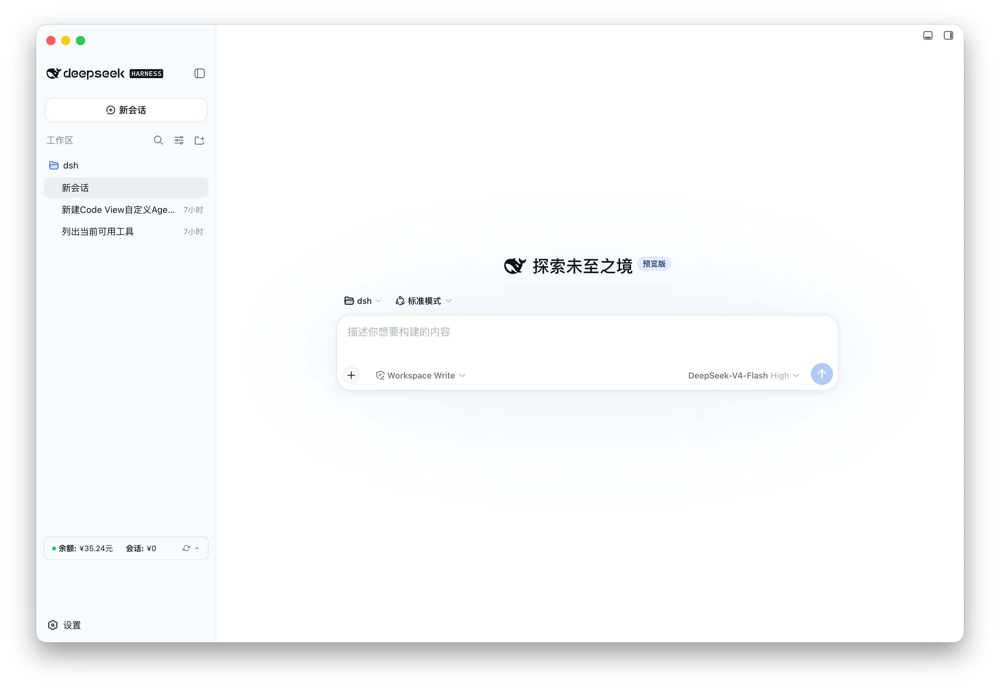

<h1 align="center">
  
  <br />
  DeepSeek Harness Desktop
</h1>

<p align="center">
  面向 <a href="https://github.com/deepseek-ai/deepseek-harness">DeepSeek Harness</a>
  的轻量、本地优先、跨平台桌面封装。
</p>

<p align="center">
  <a href="README.md">English</a> · <strong>简体中文</strong>
</p>

<p align="center">
  <a href="https://github.com/krystal-cao/deepseek-harness-desktop/releases/latest"></a>
  <a href="LICENSE"></a>
  <a href="https://github.com/krystal-cao/deepseek-harness-desktop/actions/workflows/release.yml"></a>
  
</p>



DeepSeek Harness Desktop 将官方 DeepSeek Harness Web 体验封装为独立桌面应用。无需手动启动 CLI 或管理端口，打开应用即可使用完整 Harness 界面。

本项目专注于桌面宿主能力，不 fork、不修改、不注入，也不重新实现 Harness UI。模型、会话、设置、插件和 Agent 能力均由官方 `@deepseek-ai/dsh` 提供。

> [!IMPORTANT]
> 本项目是非官方社区封装，目前仍属于早期版本，并依赖快速演进中的 `@deepseek-ai/dsh@0.1.0-rc.6`。macOS 构建尚未经过 Apple 公证，Windows 构建尚未进行商业代码签名。

## 下载

| 平台 | 架构 | 安装包 | 下载 |
| --- | --- | --- | --- |
| macOS | Apple Silicon | DMG / ZIP | [下载](https://github.com/krystal-cao/deepseek-harness-desktop/releases/latest) |
| macOS | Intel | DMG / ZIP | [下载](https://github.com/krystal-cao/deepseek-harness-desktop/releases/latest) |

全部当前和历史安装包可在 [GitHub Releases](https://github.com/krystal-cao/deepseek-harness-desktop/releases) 查看。

## 为什么需要桌面版

DeepSeek Harness 已经提供完整的 Agent Runtime 和 Web UI。本项目不重复实现这些能力，而是补充桌面应用所需的宿主层：

- 自动启动和关闭本地 Harness 服务
- 自动分配随机 `127.0.0.1` 回环端口
- 等待 Harness 就绪后再显示应用窗口
- 提供单实例桌面窗口和外部链接安全处理
- 为渲染进程启用沙箱、`contextIsolation` 和导航限制
- 为 macOS（Apple Silicon 与 Intel）提供可直接安装的发行包

## 主要特性

- Harness 就绪后直接进入官方界面，无额外操作步骤
- 启动 Harness 服务时显示轻量等待界面，不再出现无响应感
- macOS 下关闭窗口时隐藏到 Dock（不再使用托盘图标）
- 保留完整的设置、模型、会话、插件和 Agent 能力
- 应用退出时自动终止 Harness 子进程
- Web 服务仅监听随机本地回环端口，不暴露到局域网
- macOS 支持 Apple Silicon 和 Intel
- macOS 标题栏会与 DSH 当前浅色或深色主题自然融合，侧边栏收起时红绿灯也始终落在栏上
- 内置 dsh 版本管理：可从 npm 安装、切换、卸载官方 `@deepseek-ai/dsh` 版本，
  安装时自动把桌面内置的插件族对齐到同一版本，无需重新打包应用
- 可自动跟随官方最新 RC：启动后后台安装并切换到 npm 上最新的
  `0.1.0-rc.*` 版本（可在 dsh 管理窗口中关闭）
- 支持插件管理：可在 dsh 管理窗口中列出、安装、卸载 web profile 的第三方
  插件（等价于 `dsh plugin --profile web ...`），操作完成后自动重启 dsh 服务
- 内置桌面宿主桥接插件：自动安装到 web profile，通过 preload 桥接向壳层
  上报插件激活（就绪）和主题变化，不再依赖 UI 文本/类名嗅探——原有的
  DOM/CSS 探测只作为兜底保留

## 安装说明

### macOS

macOS 构建已进行完整性签名，但尚未经过 Apple 公证。首次启动：

1. 打开 DMG，将 **DeepSeek Harness** 拖入“应用程序”。
2. 尝试打开应用；如果 macOS 阻止启动，请点击“完成”。
3. 打开“系统设置 → 隐私与安全性”。
4. 在“安全性”区域找到 DeepSeek Harness，点击“仍要打开”。
5. 再次点击“打开”确认。

该确认通常只需完成一次。

## 安全模型

- Harness 服务仅绑定 `127.0.0.1`，每次启动使用随机端口
- Renderer 禁用 Node.js 集成
- 启用 `contextIsolation` 和 Chromium sandbox
- 新窗口和跨域导航交由系统浏览器处理
- Harness 在独立的 Electron Node 子进程中运行
- Cordis HMR 所需的 `--expose-internals` 只授予 Harness 子进程，不暴露给 Renderer
- 桌面宿主桥接插件从应用内置路径自动安装（无网络依赖），只上报就绪和主题
  事件，并在插件列表中标记为“内置”

## 运行架构

```text
DeepSeek Harness Desktop
├── Electron Main
│   ├── 单实例窗口
│   ├── Harness 子进程生命周期
│   ├── 随机回环端口与就绪检测
│   └── 平台菜单和外部链接处理
│
├── Harness Child Process
│   └── @deepseek-ai/dsh web
│       └── http://127.0.0.1:<random-port>
│
└── Sandboxed BrowserWindow
    └── DeepSeek Harness Web UI
```

## 当前验证状态

| 平台 | 构建 | 打包后启动 | Web UI |
| --- | --- | --- | --- |
| macOS Apple Silicon | DMG / ZIP 通过 | 通过 | HTTP 200 |
| macOS Intel | DMG / ZIP 通过 | 通过 | HTTP 200 |

所有发行包都由匹配平台的 GitHub-hosted runner 构建，并在发布前执行打包后 smoke test。

## 已知限制

- 上游 DSH 仍是 RC 版本，接口和行为可能快速变化
- macOS 尚未接入 Developer ID 和 notarization
- 目前只提供 macOS 构建（Apple Silicon 与 Intel）

## 自动更新

本 fork 通过 `electron-updater` 提供整包自动更新。一次更新会替换整个应用，
包括内置的 `@deepseek-ai/dsh` 运行时。想更快跟上上游，也可以使用内置的
**dsh 管理窗口**（帮助 → dsh 版本管理…）直接从 npm 安装并切换到新版官方
`@deepseek-ai/dsh`，不必等待新版桌面包。窗口中还提供“自动跟随最新 RC”
开关和 web profile 的插件管理（列表、安装、卸载）。

- 打包后的应用会在启动 5 秒后检查更新，之后每 4 小时检查一次；**帮助**菜单也
  提供**检查更新…**入口。
- 更新源在构建时写入 `app-update.yml`。CI 会自动指向本仓库的 GitHub Releases；
  本地构建则修改 `package.json` 中 `build.publish.owner` / `build.publish.repo`。
- 运行时覆盖：设置 `DSH_UPDATE_URL` 可切换到 generic 更新源（适合测试或非
  GitHub 镜像）；设置 `DSH_DISABLE_AUTO_UPDATE=1` 可关闭更新。npm registry
  默认使用国内镜像 `registry.npmmirror.com`（用于版本目录和运行时安装），
  可通过 `DSH_NPM_REGISTRY` 覆盖，例如改回 `https://registry.npmjs.org/`。
  也可以在“帮助 → dsh 版本管理… → npm 镜像地址”里直接修改并保存（提供
  npmmirror、npm 官方、腾讯云、华为云等常用镜像建议）。

### 发版流程

1. `node scripts/check-upstream.mjs` — 对比当前固定的 dsh 版本与 npm 最新版。
2. `node scripts/bump-dsh.mjs 0.1.0-rc.x` — 把所有 `@deepseek-ai/dsh*` 固定依赖
   升到同一版本，重新安装并运行测试。
3. `npm run dist:mac:all && npm run smoke:packaged` — 验证打包后的应用能启动
   并返回 HTTP 200（同时构建 Apple Silicon 与 Intel）。
4. `npm run clean:dist` — 删除本地构建产物，避免 Spotlight/Finder 索引到第二份应用。
5. 修改 `package.json` 的 `version`，推送 `vX.Y.Z` tag。Release 工作流会构建、
   冒烟测试并把 DMG、ZIP、`latest-mac.yml` 发布到 GitHub Releases；已安装的
   应用会提示用户重启完成更新。

`check-upstream.yml` 工作流每天检查一次：上游在 npm 发布新的 `0.1.0-rc.*`
版本时，会自动开一个升级 PR。

注意：macOS 自动更新要求应用已签名。当前使用 ad-hoc 签名，适合自用或小范围
分发；公开发布时应切换到 Apple Developer ID 签名并做公证。

## 上游版本与许可

当前固定使用 `@deepseek-ai/dsh@0.1.0-rc.6` 作为内置默认版本，以保证打包结果
可复现。其他官方版本可通过 dsh 版本管理在运行时安装。

桌面封装采用 [MIT License](LICENSE)。内置的 DeepSeek Harness 同样采用 MIT License，其许可声明保存在 [`third-party-licenses/deepseek-harness-LICENSE`](third-party-licenses/deepseek-harness-LICENSE)。

本项目与 DeepSeek 不存在隶属或官方合作关系。DeepSeek Harness 及相关名称的权利归其各自所有者所有。应用图标使用上游 DeepSeek Harness Web favicon 中的黑色鲸鱼图案。
